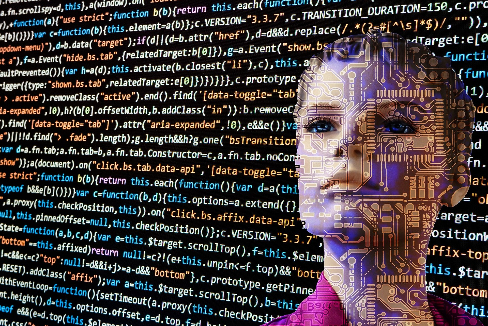

# Bias in Age & Gender Prediction CNN

#### Examining bias in VGG-Face through the lens of age and gender prediction to encourage the development of fair, accountable, and transparent machine learning.

The initial approach focuses on predicting the age and gender based on images of faces, with the academic goal of implementing exploring bias in image classification. 

While some stores already use visual recognition for theft control. The business implication of this could be facial recognition to enhance store loyalty programs or for customization of services. A Forbes article points out that loyalty members have generally already agreed to share personal data with the brand, so enhancement of loyalty programs through facial recognition may not be far in the future.

With its burgeoning ubiquity, it is important to understand this technology, so the inner workings of image detection and classification are explored by building a convolutional neural net capable of predicting a person’s age and gender from his or her image. With the use of transfer learning, a model trained with a large image set can be re-trained with a dataset of photos of people "in-the-wild", which are more suited for the interests of the project. Then using predictions from the model, a further examination of any bias the model might have is made. Although the findings may not be perfectly representative of the models being used in commercial deployment today, this project aims to shed light on bias in machine learning and to highlight the importance of thoughtful development of fair, accountable, and transparent machine learning.

## Usage
The Apparent_Age_Prediction_UTK python notebook is used for model re-training and for apparent age prediction and csv creation, as input to the Correction_Model notebook which processes the model output bias based on age, gender and race. The Gender Prediction UTK notebook predicts gender based on images.

## Requirements
This repository was tested on a specific environment. It can be re-created using the environment.yml file.

## License
This project is released under the MIT license. However, the [IMDB-WIKI dataset](https://data.vision.ee.ethz.ch/cvl/rrothe/imdb-wiki/) used in this project is originally provided under the following conditions. 

> Please notice that this dataset is made available for academic research purpose only. All the images are collected from the Internet, and the copyright belongs to the original owners. If any of the images belongs to you and you would like it removed, please kindly inform us, we will remove it from our dataset immediately.

Therefore, the pretrained model(s) included in this repository is restricted by these conditions (available for academic research purpose only).

## References and Acknowledgments 
### Datasets:
* [UTK-Face](https://susanqq.github.io/UTKFace/)
* [IMDB-WIKI](https://data.vision.ee.ethz.ch/cvl/rrothe/imdb-wiki/)

### Github Repos:
* https://github.com/yu4u/age-gender-estimation
* https://github.com/serengil/tensorflow-101
